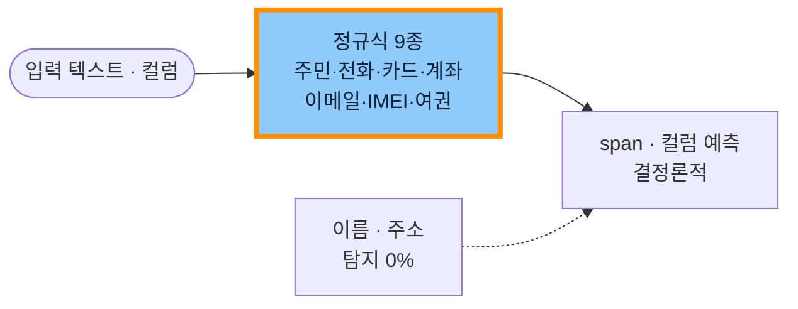
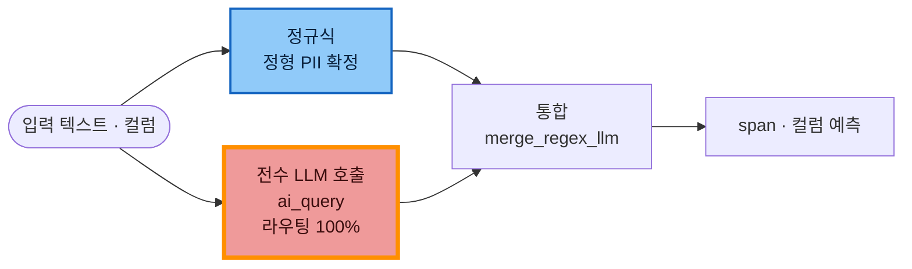
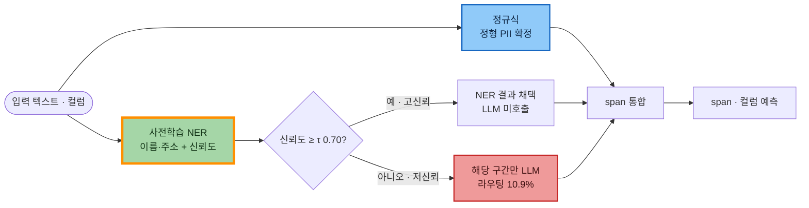
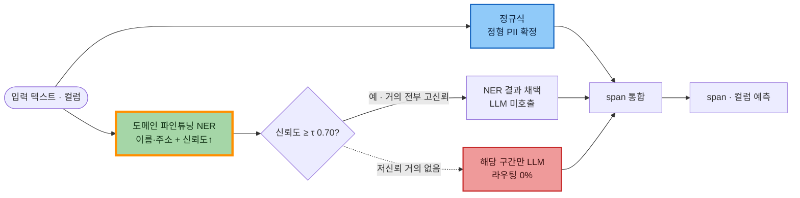
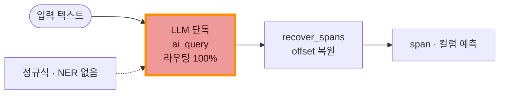
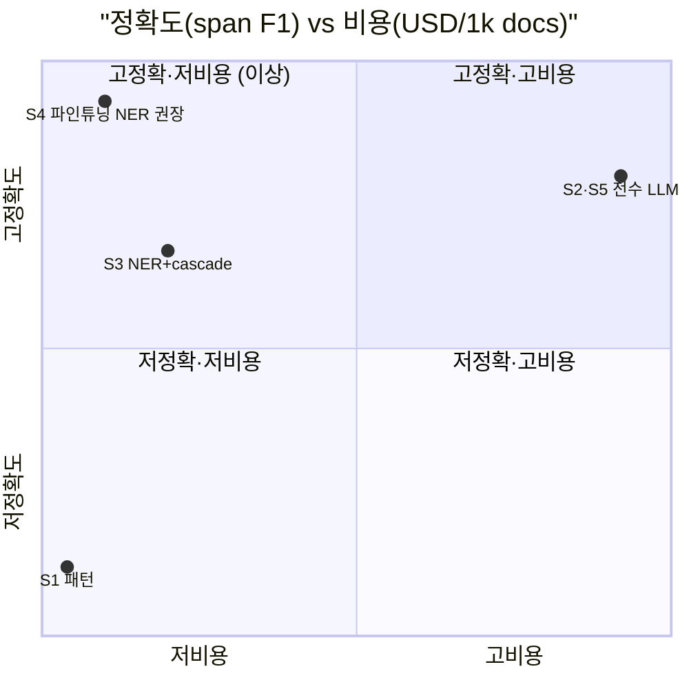
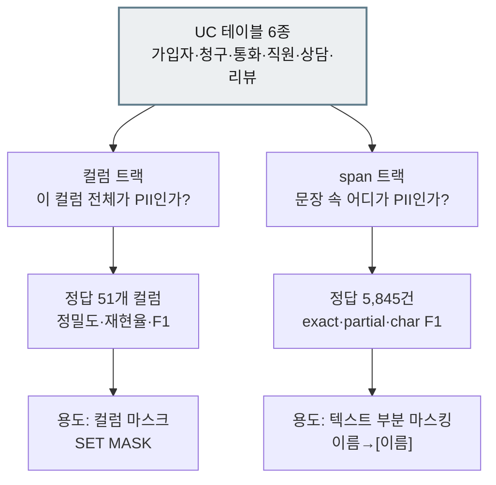
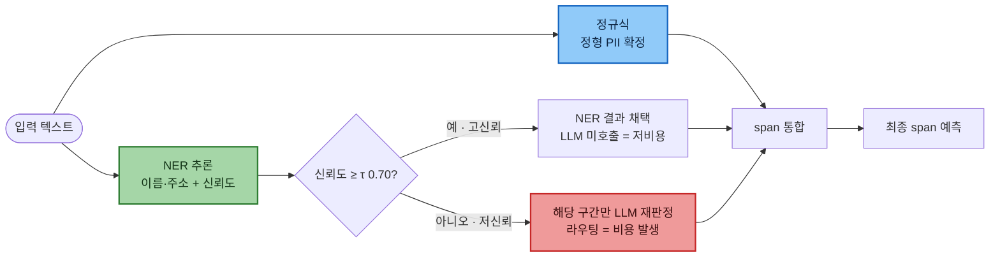
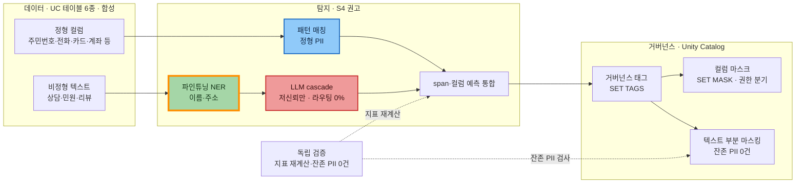

# 단계별 아키텍처 (Learning Path) — S1→S5 진화 서사

> **이 문서는 언제 읽나요?** 노트북 실행 직전/병행 — 단계가 왜 이렇게 진화하는지 이해할 때.  
> · **선행:** [`02_핵심_개념.md`](02_핵심_개념.md) · **다음:** [`04_결과_해석과_단계_선택.md`](04_결과_해석과_단계_선택.md) · **소요:** 20분

PII 탐지에는 단일 정답이 없습니다. 그래서 이 랩은 5개의 완성된 정답이 아니라,
**한 단계의 한계가 다음 단계의 동기가 되는 진화의 사슬**로 구성했습니다.

**오늘의 출발점(AS-IS).** 대부분의 통신 데이터에서 정형 PII(주민번호·전화·카드)는
부서·시스템마다 **제각각으로 처리되고**, 상담메모·민원·리뷰 같은
**비정형 텍스트 속 이름·주소는 사실상 미탐이거나 수작업에 의존**합니다.
아래 5단계는 바로 이 출발점에서 시작해,
**각 단계마다 하나의 구체적 고통(pain)을 아키텍처로 풀고, 그 해법이 남기는 새 고통이 다음 단계를 부르는** 흐름으로 읽힙니다.

> 각 단계는 동일한 순서로 전개됩니다 —
> **① 왜 이 단계가 필요한가(직전의 고통) → ② 이 아키텍처가 어떻게 푸는가 → ③ 결과(핵심 수치) → ④ 남는 한계(=다음 단계의 동기).**
> 절 끝에 해당 노트북 링크가 있습니다.

> 개념 용어(NER·cascade·τ·F1 등)가 낯설면 먼저 [`02_핵심_개념.md`](02_핵심_개념.md) 를 읽고 오세요.  
> 수치 읽는 법과 "어느 단계를 고를까" 결정트리는 [`04_결과_해석과_단계_선택.md`](04_결과_해석과_단계_선택.md) 에 있습니다.

---

## 도식 (a) — 5단계 진화 흐름

화살표 위 라벨이 곧 **각 단계의 동기**입니다 — 직전 단계의 고통이 다음 단계를 부릅니다. ★는 권장 단계(S4).

```mermaid
flowchart LR
    S1["S1 패턴매칭<br/>F1 0.73 · $0"]
    S2["S2 패턴+LLM<br/>F1 0.94 · $0.132"]
    S3["S3 패턴+NER+cascade<br/>F1 0.90 · $0.0244"]
    S4["S4 패턴+파인튜닝NER<br/>F1 0.98 · $0.01 ★"]
    S5["S5 LLM 단독<br/>F1 0.94 · $0.132"]
    S1 -->|"이름·주소 0% → LLM으로 회수"| S2
    S2 -->|"전수 LLM 비용 부담 → NER로 선별"| S3
    S3 -->|"범용 NER 과탐 → 도메인 파인튜닝"| S4
    S4 -.->|"가장 단순한 대안: 학습 없이 LLM만"| S5
    class S4 stageStar
    class S1,S2,S3,S5 stage
    classDef stage fill:#ECEFF1,stroke:#607D8B,stroke-width:1px,color:#1A1A1A;
    classDef stageStar fill:#ECEFF1,stroke:#FF8F00,stroke-width:4px,color:#1A1A1A;
```

> 도식 색 약속(공통): 🟦 정규식 · 🟩 NER · 🟥 LLM. 굵은 금색 테두리 = 이번 단계의 핵심 변화, ★ = 권장 단계(S4).

---

## S1 — 패턴매칭(정규식): 모든 진화의 출발점

> **한 줄 요약** — 정형 PII는 정규식으로 즉시·공짜로 잡되, 이름·주소는 0%. 모든 진화의 기준선(baseline)을 세운다.

#### ① 왜 이 단계가 필요한가
앞서 본 오늘의 출발점에서 가장 먼저 필요한 것은 **싸고 결정론적인 바닥**입니다. 형식이 고정된 정형 PII(주민번호·전화·카드)만이라도 학습도 비용도 없이 일관되게 잡아, 이후 모든 단계가 딛고 설 기준선을 세웁니다.

#### ② 이 아키텍처가 어떻게 푸는가
형식이 고정된 정형 PII를 **정규식 9종**(주민번호·전화·카드·계좌·이메일·IMEI·여권)으로 확정합니다. 모델 학습도 LLM 호출도 GPU도 없어, 결정론적이고 거의 공짜로 동작합니다.

*그림 S1 — 정규식만으로 정형 PII 확정. 학습·LLM 없음. 이름·주소는 못 잡음.*

#### ③ 결과
정형 PII는 거의 완벽히 잡습니다(합성 데이터 기준 정밀도 1.0 — 생성기·탐지기가 같은 형식을 공유한 **상한치**입니다). 결과가 결정론적이라 검증도 쉽습니다. 다만 헤드라인인 span exact F1은 **0.7316**에 그치는데, 이름·주소를 통째로 놓치기 때문입니다(정밀도 한 숫자만 보면 속는 대표 사례 → [`04_결과_해석과_단계_선택.md`](04_결과_해석과_단계_선택.md) §3 직관 ①).

| 지표 | 값 | 한 줄 의미 |
|---|---|---|
| span exact F1 | 0.7316 | 기준선(비정형 미탐으로 낮음) |
| char recall | 0.78 | 미탐 척도 |
| col F1 | 0.77 | 컬럼 트랙(별도 질문) |
| LLM 라우팅율 | — | 비용 레버(LLM 미사용) |
| 유효비용(USD/1k) | $0 | 예시 단가 추정 |

> 모든 단계의 수치는 [`04_결과_해석과_단계_선택.md`](04_결과_해석과_단계_선택.md) §1 단일 비교표와 일치합니다(gpt-oss-120b · 평가 4,860 docs 기준).

#### ④ 남는 한계 → 다음 단계의 동기
**이름·주소는 0%** 입니다. "이름처럼 생긴 글자"라는 패턴이 없어 정규식으로 표현할 수 없기 때문입니다. 정형은 다 잡아도 비정형을 통째로 놓치는 셈입니다.

> **다음 단계로 가는 이유** — 비정형(이름·주소)을 회수하려면 형식이 아니라 *문맥*을 이해하는 도구가 필요하다. → LLM을 더하자(S2).

→ 노트북: [`../../10_S1_pattern/`](../../10_S1_pattern/)

---

## S2 — 패턴 + LLM: 비정형을 회수하다

> **한 줄 요약** — 모든 텍스트에 LLM을 더해 이름·주소를 회수한다. 정확도는 도약하지만 비용은 최대.

#### ① 왜 이 단계가 필요한가
S1은 정형 PII는 완벽에 가깝게 잡았지만 **이름·주소를 통째로 놓쳤습니다**(char recall 0.78). 비정형 PII는 "형식"이 아니라 "문맥"으로만 식별됩니다 — 상담메모에 적힌 "김영수 고객님"의 *김영수* 는 정규식으로 표현할 패턴이 없습니다. 문맥을 이해하는 도구가 필요합니다.

#### ② 이 아키텍처가 어떻게 푸는가
S1의 정규식 위에 **전수 LLM 한 겹**을 더합니다. 정형 PII는 정규식 결과를 그대로 신뢰하고, **모든 텍스트에 LLM을 호출**해 이름·주소 같은 비정형 PII를 찾아 합칩니다(`merge_regex_llm`). 컬럼 트랙에서는 LLM이 함정 컬럼(`card_type`·`due_date` 등)의 오탐도 제거합니다.

*그림 S2 — S1 정규식은 그대로 두고, 모든 텍스트를 LLM에 보내 이름·주소를 회수. 신규=전수 LLM, 라우팅 100%.*

#### ③ 결과
LLM이 문맥을 이해해 정규식이 못 잡던 이름·주소를 메우면서, span exact F1이 **0.9448**, char recall **0.998**로 도약합니다. 컬럼 F1도 0.77→**0.9091**로 5단계 중 최고입니다.

| 지표 | 값 | 한 줄 의미 |
|---|---|---|
| span exact F1 | 0.9448 | 비정형 회수로 도약 |
| char recall | 0.998 | 미탐 척도 |
| col F1 | 0.9091 | 컬럼 트랙 — 5단계 중 최고 |
| LLM 라우팅율 | 100% | 비용 레버(전수 호출) |
| 유효비용(USD/1k) | $0.132 | 5단계 중 최고가 |

#### ④ 남는 한계 → 다음 단계의 동기
대가는 비용입니다. **모든 문서를 LLM에 보내므로**(라우팅 100%) 유효비용이 **$0.132/1k docs**로 가장 높고, 처리량·지연 제약도 크며, 호스팅 FM이면 데이터가 외부로 전송됩니다.

> **다음 단계로 가는 이유** — 비정형을 잡되 전수 LLM 비용은 피하고 싶다. 이름·주소를 *싸게* 먼저 잡고, LLM은 정말 어려운 구간에만 쓸 수 없을까? → NER + cascade(S3).

→ 노트북: [`../../20_S2_pattern_llm/`](../../20_S2_pattern_llm/)

---

## S3 — 패턴 + 사전학습 NER + cascade: 비용을 선별하다

> **한 줄 요약** — 이름·주소를 NER로 먼저 잡고 LLM은 저신뢰 구간에만 보내(cascade) 비용을 약 1/5로 줄였다. (남는 한계: 범용 NER이 통신 도메인에 과탐해 정확도가 오히려 S2보다 낮다.)

#### ① 왜 이 단계가 필요한가
S2는 비정형을 회수했지만 **모든 문서를 LLM에 보내**(라우팅 100%) 비용·지연·외부전송이 가장 컸습니다. 그런데 이름·주소의 대부분은 사실 그렇게 어렵지 않습니다 — 정말 애매한 일부만 LLM이 필요할 뿐입니다. 그렇다면 **쉬운 구간은 싼 모델이 처리하고, 어려운 구간만 LLM에 넘기면** 정확도는 지키면서 비용을 크게 줄일 수 있습니다.

#### ② 이 아키텍처가 어떻게 푸는가
S2의 전수 LLM을 **'사전학습 NER + cascade'로 교체**합니다. 달라진 곳은 비정형 처리 경로 하나입니다.

> - 정규식(정형 PII)은 S1·S2와 동일하게 그대로 확정합니다.
> - 이름·주소는 **사전학습 NER**(일반 말뭉치로 학습된 한국어 NER)이 먼저 잡습니다.
> - NER이 붙인 신뢰도가 **τ(0.70) 이상이면 그대로 채택**하고, **τ 미만인 저신뢰 구간만 LLM으로** 보냅니다(cascade).

LLM을 *전수*가 아니라 *선택적*으로만 호출하는 첫 단계입니다(NER·cascade·τ 개념은 [`02_핵심_개념.md`](02_핵심_개념.md) ⑤·⑧).

*그림 S3 — 사전학습 NER로 이름·주소를 싸게 먼저 잡고, 저신뢰(τ<0.70)만 LLM. 라우팅 10.9%.*

#### ③ 결과
선별 호출의 효과는 분명합니다 — **LLM 라우팅율이 100%→10.9%로** 떨어져 유효비용이 **$0.0244/1k docs**, S2($0.132)의 약 1/5 수준이 됩니다. NER이 이름·주소의 대부분을 저비용으로 처리한 결과입니다.

다만 정확도는 기대와 반대로 움직입니다. span exact F1이 **0.8966**으로, 오히려 S2(0.9448)보다 **낮습니다.**

| 지표 | 값 | 한 줄 의미 |
|---|---|---|
| span exact F1 | 0.8966 | 범용 NER 과탐으로 S2보다 낮음 |
| char recall | 0.9448 | 미탐 척도 |
| col F1 | 0.84* | 컬럼 트랙 — S4와 동률 |
| LLM 라우팅율 | 10.9% | 비용 레버(선별 호출) |
| 유효비용(USD/1k) | $0.0244 | S2의 약 1/5 |

> col F1 0.84\*는 S4와 같습니다 — 파인튜닝 효과는 span 경계 정확도에만 나타나고 컬럼 판정("이 칸이 PII인가")에는 영향이 없기 때문입니다. 헤드라인은 span F1이며, col F1과의 차이는 [`04_결과_해석과_단계_선택.md`](04_결과_해석과_단계_선택.md) §3 직관 ④에서 다룹니다.

#### ④ 남는 한계 → 다음 단계의 동기
원인은 NER의 *출신*입니다. 사전학습 NER은 뉴스·위키 같은 **일반 말뭉치로 학습돼 통신 도메인(상담메모의 한국 이름·주소 표기)에 과탐**합니다 — 이름이 아닌 것을 이름이라 하고, 그것도 높은 신뢰도로 주장해 cascade가 LLM에 넘기지도 못합니다. 그 오탐이 정밀도를 깎은 것입니다(왜 더 낮아지는지는 [`04_결과_해석과_단계_선택.md`](04_결과_해석과_단계_선택.md) §3 직관 ②).

> **다음 단계로 가는 이유** — 비용은 줄였지만 범용 모델의 과탐이 정확도를 떨어뜨렸다. 우리 도메인 데이터로 NER을 *다듬으면* 정확도가 오르고, 동시에 자신감도 올라 LLM 라우팅(=비용)도 더 줄지 않을까? → 도메인 파인튜닝(S4).

→ 노트북: [`../../30_S3_pattern_ner_llm/`](../../30_S3_pattern_ner_llm/)

---

## S4 — 패턴 + 파인튜닝 NER + cascade: 정확도와 비용을 동시에 ★

> **한 줄 요약** — 도메인 라벨로 NER을 파인튜닝하자 정확도와 *자신감*이 함께 올라, cascade가 LLM에 넘길 구간이 사라졌다(라우팅 0%). 정확도 최고·비용 최저를 동시에 달성. (남는 한계: 도메인 라벨 필요 + 0.9838은 합성 상한치.)

#### ① 왜 이 단계가 필요한가
S3에서 비용은 1/5로 내려갔지만, 그 대가로 정확도가 S2보다 낮아졌습니다. 원인은 분명했습니다 — **범용 NER이 우리 도메인을 몰라서 과탐**했기 때문입니다. 그렇다면 모델에게 "우리 데이터에서 이름·주소는 이렇게 생겼다"를 가르치면, 과탐이 줄어 정확도가 회복되지 않을까요?

#### ② 이 아키텍처가 어떻게 푸는가
구조는 S3와 **완전히 같습니다**(정규식 + NER + cascade, τ=0.70). 단 하나, NER을 사전학습 그대로 쓰지 않고 **우리 도메인 라벨로 파인튜닝(KoELECTRA)** 한 점만 다릅니다.

학습의 정직성이 핵심입니다. **평가셋과 분리된 학습 코퍼스**로 파인튜닝했습니다.

> - 학습: 별도 코퍼스(seed=777, 2,946 문서) — 평가셋과 글자 그대로 겹치는 문서 **0건**.
> - 평가: 신규 코퍼스 전체(4,860 문서).

즉 "과거 라벨로 학습해 신규 데이터에 적용한다"는 현실 시나리오를 모사한 것이지, 같은 데이터를 외워 점수를 부풀린 것이 아닙니다(데이터 누수 방지 → [`02_핵심_개념.md`](02_핵심_개념.md) ⑥).

*그림 S4 ★ — 구조는 S3와 동일, NER만 도메인 파인튜닝. 자신감↑ → 저신뢰 거의 없음 → 라우팅 0%.*

#### ③ 결과
파인튜닝이 만든 효과가 이 랩 전체의 핵심입니다. **파인튜닝은 NER의 정확도와 자신감(신뢰도)을 동시에 끌어올립니다.** NER이 더 자신 있어지자 **τ(0.70) 미만인 저신뢰 구간이 거의 사라졌고**, 그래서 cascade가 LLM에 넘길 일이 없어집니다 — **LLM 라우팅율 0%**. LLM을 사실상 한 번도 부르지 않고도 span exact F1 **0.9838**(5단계 최고)·char recall **1.0**(놓친 PII 글자 0)을 내면서, 비용은 **$0.01/1k docs**(NER 추론 오버헤드만)로 최저입니다. **정확도↑와 비용↓를 동시에 달성**한 것이 S4의 클라이맥스입니다(이 합성 효과의 자세한 해부는 [`04_결과_해석과_단계_선택.md`](04_결과_해석과_단계_선택.md) §3 직관 ③).

| 지표 | 값 | 한 줄 의미 |
|---|---|---|
| span exact F1 | 0.9838 | 5단계 중 최고 |
| char recall | 1.0 | 놓친 PII 글자 0 |
| col F1 | 0.84* | 컬럼 트랙 — S3와 동률 |
| LLM 라우팅율 | 0% | LLM 거의 미호출 |
| 유효비용(USD/1k) | $0.01 | NER 추론 오버헤드만 |

> col F1이 S3와 같은 0.84\*인 것은 정상입니다 — 파인튜닝의 가치는 컬럼 판정이 아니라 span 경계 정확도(0.8966→0.9838)에서 드러납니다([`04_결과_해석과_단계_선택.md`](04_결과_해석과_단계_선택.md) §3 직관 ④).

#### ④ 남는 한계 → 다음 단계의 동기
S4의 두 전제를 분명히 해야 합니다. 첫째, 파인튜닝에는 **우리 도메인의 라벨 데이터가 필요**합니다(합성에선 공짜지만 실데이터에선 사람이 표본을 라벨링해야 함). 둘째, **0.9838은 학습-평가를 엄격히 분리했어도 여전히 합성 데이터 상한치**입니다 — 실데이터 기대치는 약 0.85~0.92로 더 보수적으로 잡고, 자체 라벨로 재파인튜닝·재검증해야 합니다(→ [`06_내_데이터에_적용.md`](06_내_데이터에_적용.md)).

> **권고** — 대량·상시 운영에는 S4가 최적입니다. in-region 요구가 있으면 LLM 백엔드를 qwen으로 두되, S4는 라우팅 0%라 LLM 의존이 최소여서 그 영향이 작습니다.

> **다음 단계로 가는 이유** — S4는 강력하지만 라벨·파인튜닝이라는 준비 비용이 든다. 정반대 극단 — 구성요소 없이 *LLM 하나만* 쓰면 어디까지 가능한지를 확인해, S4의 가치를 역으로 입증한다. → LLM only(S5).

→ 노트북: [`../../40_S4_pattern_nerft_llm/`](../../40_S4_pattern_nerft_llm/)

---

## S5 — LLM only: 가장 단순한 대안

> **한 줄 요약** — 정규식·NER을 모두 걷어내고 LLM 하나로. 가장 단순하지만 S2 대비 우위는 없다.

#### ① 왜 이 단계가 필요한가
S4는 강력하지만 도메인 라벨과 파인튜닝이라는 준비 비용이 듭니다. 그렇다면 정반대 극단 — **구성요소 없이 LLM 하나만** 쓰면 어디까지 갈 수 있을까요? 이 질문에 답하는 것이 S5이며, 동시에 "패턴+LLM"이나 파인튜닝이 정말 값어치를 하는지를 역으로 검증합니다(빠른 PoC·저빈도 워크로드용).

#### ② 이 아키텍처가 어떻게 푸는가
S4의 정규식·파인튜닝 NER·cascade를 **모두 걷어내고 LLM 단독**만 남깁니다. LLM이 텍스트의 PII를 모두 찾고 `recover_spans`로 위치(offset)를 복원합니다. 구성이 가장 단순한 대신, 다시 전수 LLM(라우팅 100%)이 되어 S2와 같은 비용 프로파일로 돌아갑니다.

*그림 S5 — 정규식·NER 없이 LLM 단독, recover_spans로 offset 복원. 라우팅 100%(=S2 비용).*

#### ③ 결과
모델 학습·라벨링 없이도 span exact F1 **0.9441**, char recall **0.9975**로 S2에 버금가는 성능을 즉시 냅니다.

| 지표 | 값 | 한 줄 의미 |
|---|---|---|
| span exact F1 | 0.9441 | S2와 사실상 동률(우위 없음) |
| char recall | 0.9975 | 미탐 척도 |
| col F1 | 0.8889 | 컬럼 트랙 — S2보다 낮음 |
| LLM 라우팅율 | 100% | 비용 레버(전수 호출) |
| 유효비용(USD/1k) | $0.132 | S2와 동일(최고가) |

#### ④ 남는 한계 → 결론
문제는 **S2 대비 우위가 없다**는 점입니다 — span은 사실상 동률(0.9441 vs 0.9448), col F1은 오히려 더 낮습니다(0.8889 vs 0.9091). 비용도 $0.132로 S2와 같습니다. 즉 S5는 **정확도·비용에서 S2에 밀리는**(Pareto 열위) 선택이며, 유일한 장점은 *파이프라인 단순성*입니다. 그래서 대량·상시 운영의 권장 기본은 여전히 S4입니다.

→ 노트북: [`../../50_S5_llm_only/`](../../50_S5_llm_only/)

---

## 도식 (b) — 정확도 vs 비용 사분면

이상적인 위치는 **왼쪽 위(고정확도·저비용)** 입니다. S4가 거기에 가장 가깝습니다. (저비용이 x축 왼쪽이므로 이상점은 왼쪽 위 사분면입니다. S2와 S5는 정확도·비용이 사실상 같아 한 점으로 표기했습니다.)

---

## 도식 (c) — 컬럼/span 이중 트랙

PII 탐지는 두 갈래로 평가합니다. 같은 단계라도 트랙에 따라 보는 것이 다릅니다(🟦 컬럼 트랙 · 🟩 span 트랙).

---

## 도식 (d) — cascade 라우팅 (S3/S4 공통 구조)

cascade의 핵심은 **신뢰도 τ 분기**입니다. 같은 구조라도 밑단 NER 품질에 따라 라우팅율이 갈립니다(S3=10.9%, S4=0%).

---

## 도식 (e) — 탐지 → 마스킹 → 거버넌스 (폐곡선)

탐지로 끝나지 않고 **보호·검증까지** 한 바퀴 도는 것이 이 랩의 메시지입니다.

→ 거버넌스 노트북: [`../../80_governance/`](../../80_governance/) ·
평가·검증 노트북: [`../../90_eval/`](../../90_eval/)

> **연결** — 거버넌스 학습 문서(두 마스킹·두 verdict·"잔존 PII 0건" 검증): [`05_거버넌스_마스킹.md`](05_거버넌스_마스킹.md).

---

## Part 2 — Day-2 운영 (배포 다음)

여기까지가 아키텍처 **구축(Day-1)** 이다. 운영(Day-2)에서는 새 PII 형식이 **라벨 없이** 유입돼 탐지기가 조용히
늙는다. 같은 5원칙(인간검토·섀도우·심판보정·격리·단일평가)을 **더 비싼 레버에 다시** 적용해, 라벨 없이 저하를
탐지하고 **싼 것부터**(규칙→LLM→NER) 고친다 — 성숙도 사다리.

→ 학습 문서: [`07_운영_모니터링_Day2.md`](07_운영_모니터링_Day2.md) · 런너블: [`../../60_monitor/`](../../60_monitor/)(60a 규칙 폐곡선 · 60b NER 재학습 게이트).

---
⬅️ 이전: [`02_핵심_개념.md`](02_핵심_개념.md) · ➡️ 다음: [`04_결과_해석과_단계_선택.md`](04_결과_해석과_단계_선택.md) · 🗺️ 지도: [`00_여기서_시작.md`](00_여기서_시작.md)
