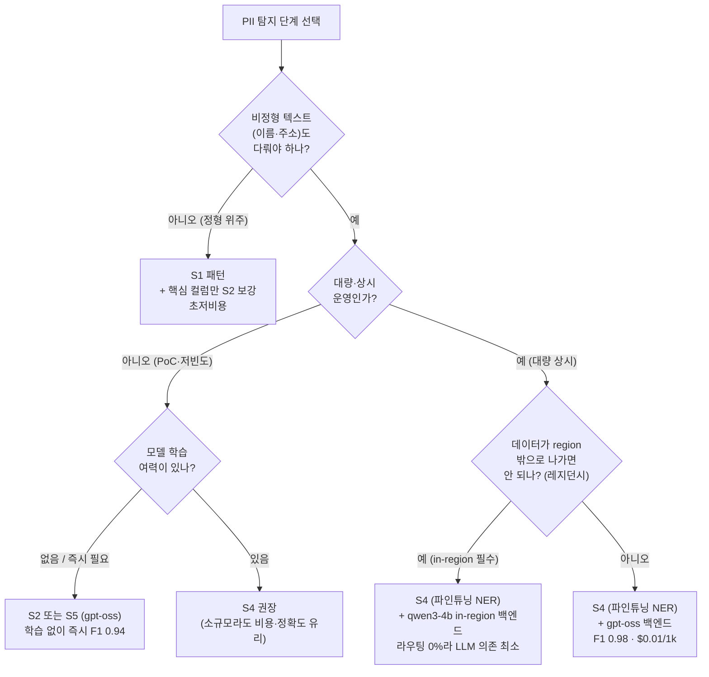

# 결과 해석과 단계 선택 (Results Interpretation) — 결과 해석 가이드

> **이 문서는 언제 읽나요?** S1~S5 노트북 실행 후 수치를 해석할 때  
> · **선행:** [`03_단계별_아키텍처.md`](03_단계별_아키텍처.md) · **다음:** [`05_거버넌스_마스킹.md`](05_거버넌스_마스킹.md) · **소요:** 20분

랩을 실행하면 비교 그리드(`arch_evo_comparison`)에 단계별 수치가 채워집니다. 이 문서는 **그 숫자를
어떻게 읽는지**, 헷갈리기 쉬운 **4가지 직관**, 그리고 **"어느 단계를 고를까" 결정트리**를 다룹니다.

> 수치는 모두 [`final_grid`] 단일 출처와 일치합니다. 개념 용어는 [`02_핵심_개념.md`](02_핵심_개념.md),
> 단계 서사는 [`03_단계별_아키텍처.md`](03_단계별_아키텍처.md) 참조.

---

## 1. 핵심 수치 비교표 (gpt-oss-120b, 평가 코퍼스 4,860 docs)

| 단계 | span exact F1 | char recall | col F1 | LLM 라우팅율 | 유효비용 (USD/1k docs) |
|---|---|---|---|---|---|
| **S1** 패턴 | 0.7316 | 0.78 | 0.77 | — | $0 |
| **S2** 패턴+LLM | 0.9448 | 0.998 | 0.9091 | 100% | $0.132 |
| **S3** 패턴+사전학습 NER+cascade | 0.8966 | 0.9448 | (0.84*) | 10.9% | $0.0244 |
| **S4** 패턴+파인튜닝 NER+cascade | **0.9838** | **1.0** | (0.84*) | **0%** | **$0.01** |
| **S5** LLM only | 0.9441 | 0.9975 | 0.8889 | 100% | $0.132 |

\* **col F1(0.84)은 헤드라인인 span F1과 다른 것을 재는 점수입니다** — span F1은 "텍스트 *어디*에 PII가
있나", col F1은 "이 *칸(컬럼) 전체*가 개인정보 칸인가"를 잽니다. S3/S4는 "규칙이 잡았거나 NER이 그 칸에서
이름·주소를 하나라도 찾으면 그 칸을 개인정보 칸으로 표시"하는 방식이라, 민감한 칸은 하나도 놓치지
않지만(재현율 1.0) 일부를 과하게 잡아(정밀도 0.72) 0.84가 됩니다. 컬럼 단위로는 범용 NER(S3)과 파인튜닝
NER(S4)이 같은 판정을 내려 **두 값이 0.84로 동일**하고, 파인튜닝의 효과는 옆 칸 span F1(0.90→0.98)에서
드러납니다. (자세히: **§3 직관 ④**)

> **0.9838 등 헤드라인 수치는 합성 데이터 상한치입니다.** 실데이터 기대치는 약 0.85~0.92 —
> [`06_내_데이터에_적용.md`](06_내_데이터에_적용.md) §3 참조.

> **표기 규율 — 숫자를 읽을 때 항상 3가지를 함께 확인하세요.**
> 1. **트랙** — col(컬럼)인가 span(텍스트 위치)인가? 둘은 다른 질문입니다.
> 2. **백엔드** — gpt-oss인가 qwen인가? 위 표는 gpt-oss 기준입니다.
> 3. **분모(n_docs)** — gpt-oss 행은 4,860 docs 전체, **qwen 행은 300 docs 표본**입니다. 그래서
>    S4 gpt-oss 0.9838 vs qwen 0.9806 차이는 주로 이 분모 차이입니다.

---

## 2. 수치별 읽는 법

| 지표 | 무엇을 뜻하나 | 이렇게 읽으세요 |
|---|---|---|
| **span exact F1** | 텍스트 내 PII를 **위치·유형까지 정확히** 맞춘 비율(P/R 균형) | 단계 간 비교의 1차 기준. 높을수록 좋음. S4가 0.9838로 최고 |
| **char recall** | 정답 PII의 **글자 중 몇 %를 덮었나**(미탐 척도) | 1.0(S4)이면 *놓친 PII 글자 0* — PII 보호에서 가장 중요한 안전 지표 |
| **col F1** | **칸(컬럼) 전체**가 개인정보 칸인지 분류한 정확도 | 컬럼 마스크 대상 선정의 근거. "텍스트 *어디*"를 재는 span F1과는 **다른 질문**(혼동 주의) |
| **LLM 라우팅율** | 전체 중 **LLM을 실제로 호출한 비율** | 비용 레버. 0%(S4)면 LLM 거의 불필요, 100%(S2/S5)면 전수 호출 |
| **유효비용** | 라우팅율 × LLM 단가(+NER 오버헤드) | **예시 단가 기반 추정·LLM 처리비 한정.** 절대값보다 단계 간 상대 비교로 |
| **마스킹 잔존 PII** | 마스킹 후 남은 gold PII 건수 | **0건**이어야 정상(C6 검증, PERSON 2자 이상 포함) |
| **검증 10/10** | 독립 검증기 통과 수(아키텍처 C1a~C7 9개 + vendoring C8) | **10/10 PASS** — 수치가 독립 재계산으로 검증됐다는 신뢰 근거 |

> **"10/10"이 뜻하는 것** — 빌드의 자체 보고를 믿지 않고, **정답(ground truth)에서 지표를 독립적으로 다시
> 계산**해 맞는지 확인한 검사 10개를 모두 통과했다는 뜻입니다. 9개는 아키텍처 정확성(정답 무결성·재현성·
> 지표 재계산·단계 단조성·마스킹 잔존 0건 등 C1a~C7), 1개는 이 패키지 코드가 원본 로직과 바이트 동일한지
> (C8 vendoring). 즉 **이 문서의 수치는 검증된 값**입니다(상세 감사는 [`../../_internal/VERIFICATION.md`](../../_internal/VERIFICATION.md)).

---

## 3. 핵심 직관 4가지 (헷갈리기 쉬운 지점)

### 직관 ① — S1은 정형 PII 정밀도 100%인데 왜 span F1이 0.73뿐인가?

정밀도 1.0은 "정규식이 *잡은 것*은 다 맞다"는 뜻이지, "*모든* PII를 잡았다"는 뜻이 아닙니다. S1은
**이름·주소(비정형)를 통째로 놓칩니다** — 정규식에 "이름 패턴"이 없기 때문입니다. 놓친 PII가
재현율을 끌어내려(char recall 0.78) F1이 0.7316에 머무릅니다. **정형은 완벽해도 비정형 미탐이 전체
점수를 깎는다** — 정밀도 한 숫자만 보면 속는 대표 사례입니다.

### 직관 ② — 왜 S3(0.8966)가 S2(0.9448)보다 낮은가?

NER을 추가해 더 똑똑해질 줄 알았는데 오히려 낮습니다. 이유는 S3의 NER이 **범용 사전학습 모델**이라
통신 도메인(한국 이름·주소 표기)에 **과탐**하기 때문입니다 — 이름이 아닌 것을 이름이라 하고, 그것도
높은 신뢰도로 주장해 cascade가 LLM에 넘기지도 못합니다. 그 오탐이 정밀도를 깎습니다. **싸졌지만
(라우팅 10.9%, 비용 1/5) 범용 모델의 과탐이라는 대가**를 치른 것입니다. 이 한계를 푸는 것이 S4의
도메인 파인튜닝입니다.

### 직관 ③ — S4의 "라우팅 0%"는 무슨 합성 효과인가?

S4는 cascade 구조(저신뢰만 LLM)인데 LLM 라우팅율이 0%입니다 — **LLM을 사실상 한 번도 부르지 않았다**는
뜻입니다. 어떻게 가능한가? **파인튜닝으로 NER이 충분히 정확해지면서 동시에 자신감(신뢰도)도 높아져,
τ(0.70) 미만인 저신뢰 구간이 거의 사라졌기** 때문입니다. 그 결과 ⓐ정확도는 최고(0.9838)·char recall
1.0이면서 ⓑ비용은 최저($0.01, NER 오버헤드만)인 **정확도·비용 동시 최적화**가 나옵니다. 이것이
파인튜닝(⑥)과 cascade(⑧)가 맞물려 만드는 핵심 합성 효과입니다.

### 직관 ④ — col F1(0.84)과 span F1(0.98)은 **다른 트랙**이다 (S3·S4 col F1이 같은 이유)

표의 col F1과 span F1은 **서로 다른 질문**을 잰 점수라 직접 비교하면 안 됩니다. **span 트랙**은 "자유텍스트 *어디*(몇 번째 글자)에 PII가 있나"(정답 5,845건)이고, **컬럼 트랙(col F1)은** "이 *칸 전체*가 개인정보 칸인가"(정답 51개 컬럼)입니다. S3/S4의 컬럼 판정 규칙은 단순합니다 — **정규식이 잡았거나, NER이 그 컬럼 텍스트에서 이름·주소를 하나라도 찾으면 그 컬럼을 PII로 플래그**합니다(LLM 미사용, `backend=NA`). 덕분에 `consult_note`·`memo` 같은 자유텍스트 컬럼이 자동 플래그되어 **컬럼 재현율은 1.0**(민감 컬럼 0건 누락), 대신 일부를 과하게 잡아 **정밀도 0.72**, 종합 **col F1 0.84**가 됩니다(놓치느니 과하게 잡는 recall 우선).

여기서 핵심은 **S3와 S4의 col F1이 0.84로 똑같다**는 점입니다. 컬럼 단위에선 "그 칸에 이름이 *있나/없나*"만 보므로, 범용 NER(S3)이든 파인튜닝 NER(S4)이든 **어차피 어떤 span은 찾아 컬럼 판정이 동일**해집니다. 즉 **파인튜닝(S4)의 가치는 컬럼 트랙이 아니라 span 트랙에서만 드러납니다** — 경계까지 정확해지며 span exact F1이 0.8966→0.9838로 올라갑니다. 그래서 col F1 0.84를 S4의 헤드라인 정확도(span 0.98)와 **혼동하면 안 됩니다.** 용도도 다릅니다: **col F1 → 어느 컬럼을 통째로 마스킹/태깅할지**(UC `SET TAGS`·`SET MASK`) 선정, **span F1 → 자유텍스트 안 정확한 위치를 부분 마스킹.** 두 축 모두 필요하기에 별개 트랙으로 함께 봅니다.

> **연결** — 이 두 verdict(컬럼=S2 / span=S4)를 거버넌스에서 실제로 어떻게 쓰는지: [`05_거버넌스_마스킹.md`](05_거버넌스_마스킹.md).

---

## 4. "어느 단계를 고를까" 결정트리

**요약 권고**

- **대량·상시 운영** → **S4**(패턴+파인튜닝 NER+cascade). LLM 호출 0%로 비용 최저($0.01/1k vs S2
  $0.132), span 정확도 최고(0.9838). in-region 필요 시 qwen 백엔드.
- **빠른 PoC·저빈도** → **S2 또는 S5(gpt-oss)**. 모델 학습 없이 즉시 높은 정확도.
- **정형 위주·초저비용** → **S1** + 핵심 컬럼만 S2로 보강.

> 모든 권고는 **합성 데이터 기준**입니다. 실데이터 적용 전 반드시
> [`06_내_데이터에_적용.md`](06_내_데이터에_적용.md) 의 현실 점검(정답 라벨·재파인튜닝·기대치)을
> 확인하세요.

---

**다음** — 컬럼=S2 / span=S4 verdict를 태그·마스크로 실제 적용하려면 [`05_거버넌스_마스킹.md`](05_거버넌스_마스킹.md),
이어서 내 데이터에 적용하려면 [`06_내_데이터에_적용.md`](06_내_데이터에_적용.md)(합성→실데이터 전환), 배포 후
라벨 없이 유지하려면 [`07_운영_모니터링_Day2.md`](07_운영_모니터링_Day2.md)(Part 2 · 드리프트·교정·재학습)로
이어집니다.

---
⬅️ 이전: [`03_단계별_아키텍처.md`](03_단계별_아키텍처.md) · ➡️ 다음: [`05_거버넌스_마스킹.md`](05_거버넌스_마스킹.md) · 🗺️ 지도: [`00_여기서_시작.md`](00_여기서_시작.md)
