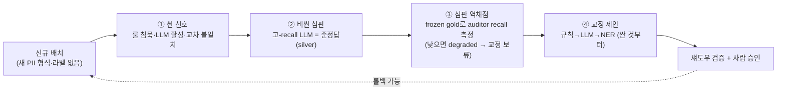

# 운영 모니터링 · Day-2 (Monitoring) — 배포 다음: 라벨 없이 신뢰 유지하기 (Part 2)

> **이 문서는 언제 읽나요?** (선택) 배포 후 운영 단계  
> · **선행:** [`06_내_데이터에_적용.md`](06_내_데이터에_적용.md) · **다음:** 없음 (마지막 문서) · **소요:** 25분

S1~S5로 아키텍처를 **구축(Day-1)** 했다면, 운영(Day-2)에서는 **새 PII 형식이 라벨 없이 유입**돼 탐지기가 조용히
늙는다. 정답이 없어 "정확도가 떨어졌다"는 것조차 측정이 안 된다. 이 문서는 그 답 — **라벨 없는 모니터링 +
가장 싼 레버부터 닫는 교정·재학습 폐곡선** — 의 멘탈모델이다. 런너블: [`../../60_monitor/`](../../60_monitor/).

> 선행 개념: [`02_핵심_개념.md`](02_핵심_개념.md) ⑭ 라벨없는 드리프트 탐지 · ⑮ 챔피언/챌린저 승격 게이트. 거버넌스: [`05_거버넌스_마스킹.md`](05_거버넌스_마스킹.md).

---

## 1. 멘탈모델 — 라벨 없이 저하를 잡는 4단계

① **싼 신호(GT-free)**: 정답 없이 탐지기 I/O만으로 의심한다. 핵심 = **"룰이 조용한데 LLM은 활성"** — S1(정규식)이
0건인데 S2(LLM)는 잡는 문서 비율이 메인 baseline 대비 급등하면 새 형식 신호. ② **비싼 심판**: 고-recall LLM
Auditor가 준-정답(silver)을 만든다. ③ **심판 역채점**: "누가 심판을 감사하나" — 매 사이클 frozen gold 표본에
auditor 자신의 recall을 재서, 낮으면 `degraded`로 그 사이클 교정을 보류한다(fail-safe). ④ **교정**: 저하 구간을
**가장 싼 레버부터** 고친다.

---

## 2. 성숙도 사다리 — 고치는 비용 × 자동화 깊이

핵심 원리: **싸고 결정론적이라 *지금* 닫을 수 있는 루프부터 자동화하고, 고치는 비용·위험이 커질수록 권한을
사람 쪽으로 되돌린다.**

| Rung | 레버 | 비용 | 이 랩에서 | 자동화 |
|---|---|---|---|---|
| **A** | **규칙(정규식)** | 거의 0 | **런너블** ([`60a`](../../60_monitor/60a_monitor_rule_loop.py)) | 제안→섀도우→사람 승인(자동 적용은 옵션) |
| **B** | **LLM(프롬프트·cascade τ)** | 중 | 개념(+옵션 τ 스윕) | 사람 승인(대시보드·MLflow eval은 운영) |
| **C** | **NER(재학습)** | 고 | **런너블-간이** ([`60b`](../../60_monitor/60b_ner_challenger_retrain.py)) | **항상 사람 승인 + canary**(model-collapse 방어) |

관통 5원칙(같은 원칙, 더 비싼 레버에 반복): ① **사람 검토 승인이 기본** ② **적용 전 섀도우 평가** ③ **심판
자기보정 + degraded 게이트** ④ **격리**(메인 불변, `*_drift`/`*_v2`만) ⑤ **단일 평가 기준 재사용**(`eval_lib` regime).

---

## 3. 라벨 없는 신호 3종 + 심판 보정

- **프록시(탐지기 I/O 내재)**: 룰 침묵·LLM 활성 비율, 근접실패 shape-probe, LLM 파싱 실패율 — 전부 결정론적 SQL.
- **실버(LLM 심판)**: 고-recall Auditor 전수 스캔 → 준-정답. 정형 타입은 정규식 co-sign으로 신뢰 가중.
- **교차 모델 합의**: 규칙·NER·LLM의 불일치 자체가 새 패턴 신호.

⚠️ **순환성 정직 고지**: Auditor가 gpt-oss인데 S2 탐지기도 gpt-oss면 같은 맹점을 공유한다. 그래서 ① 결정론적
**gold 기준** 회복만 헤드라인으로 단언하고(silver 수치는 예시) ② frozen-gold 자기보정으로 심판을 견제한다.
silver는 gold가 아니며, 합성 수치는 **상한치(상대 추세)** 로 읽는다.

---

## 4. 사람 승인 거버넌스 + 롤백

- **규칙(A)**: 교정안은 기본 **제안만**(`remediation_proposals`, 검토 대기). `APPROVE=true` 위젯에서만 `S1_FIXED`로
  적용(이 랩은 드리프트 한정). 규칙 변경은 정규식 한 줄이라 즉시 가역.
- **NER(C)**: challenger는 **3중 게이트**(신규패턴 Δrecall≥0.01 ∧ main 비퇴행 ∧ canary 비퇴행)를 통과해도 **자동 교체
  안 함**. `ner_champion_log`에 결정·수치를 기록하고, 사람(APPROVE)이 승인해야 active 모델이 바뀐다. **롤백** =
  로그에 active=champion 행 추가(레지스트리 alias 교체와 동치, 즉시 가역). 모델 가중치는 폴더 버전으로 보존(`koelectra_ner_ft`/`_v2`).
- **자동 교체 없음**이 보안팀 관점의 핵심 메시지: 시스템이 더 나은 후보를 *찾아 제안*하되, 운영 변경은 *사람이 승인*하고 *되돌릴 수* 있다.

---

## 5. 내 운영에 이식 — 통합 계약 4가지

이 프레임워크는 **4가지만 내 환경에 맞추면** 그대로 재사용된다(나머지 로직 불변):

1. **탐지기 예측** — `(stage, backend, doc_id, start_char, end_char, entity_type, pii_value, score)` 스키마로 노출.
2. **신규 배치 텍스트** — `text_corpus` 형태(doc_id·text)의 운영 유입분.
3. **작은 frozen gold** — 심판 보정용 라벨 표본(1회 구축, 소량).
4. **LLM 엔드포인트** — Auditor·cascade용(이 랩은 gpt-oss; in-region이면 qwen).

**자기 배치 단계 진단**: 라벨이 없어 측정 자체가 안 됨 → **A부터**. LLM 비용을 손으로 튜닝 중 → **B**. NER이 OOD에
늙어 재학습 필요 → **C**(반드시 게이트·canary). 일일 자동화는 이 노트북을 Databricks Job/DAB로 감싸면 된다(이 랩은
Jobs 미사용 — 운영 레퍼런스는 아래 §6).

---

## 6. 더 깊은 운영(이 랩 범위 밖) → `상위 운영 레퍼런스 아키텍처(이 랩 범위 밖)` 참조

이 랩은 학습용이라 다음은 **개념·포인터**로만 둔다(런너블 아님):

- **Rung B 풀 구현** — cascade τ 자동 스윕 프런티어 + MLflow GenAI eval + 대시보드 + 일일 스케줄.
- **Rung C 풀 구현** — 약지도 코퍼스 자동 조립, MLflow **UC 모델 레지스트리** `@champion`/`@challenger` alias, `run_job`
  스케줄, model-collapse 완화 **M-a~M-g**(혼합비 캡·합의 게이트·LLM 중재·임베딩 드리프트).
- **in-region 서빙 배포**(qwen3-4b T4), **임원 대시보드/ROI**, **오케스트레이션/Jobs** — 모두 `02_/09_monitor`·`06_serving`·
  `08_exec_dashboard`·`orchestration/` 참조. (이 학습 랩은 단순성·자기완결을 위해 의도적으로 제외.)

---

> **연결** — 런너블 [`60a`](../../60_monitor/60a_monitor_rule_loop.py)·[`60b`](../../60_monitor/60b_ner_challenger_retrain.py) · 개념 [`02_핵심_개념.md`](02_핵심_개념.md) ⑭⑮ · 진화 [`03_단계별_아키텍처.md`](03_단계별_아키텍처.md) · 거버넌스 [`05_거버넌스_마스킹.md`](05_거버넌스_마스킹.md) · 실데이터 [`06_내_데이터에_적용.md`](06_내_데이터에_적용.md).

---
⬅️ 이전: [`06_내_데이터에_적용.md`](06_내_데이터에_적용.md) · 🗺️ 지도: [`00_여기서_시작.md`](00_여기서_시작.md)
